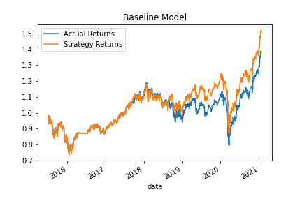
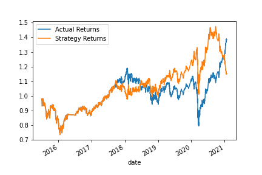

# Module-14-Challenge---algorithmic-trading-bot

## Background

For this Challenge, you’ll assume the role of a financial advisor at one of the top five financial advisory firms in the world. Your firm constantly competes with the other major firms to manage and automatically trade assets in a highly dynamic environment. In recent years, your firm has heavily profited by using computer algorithms that can buy and sell faster than human traders.

The speed of these transactions gave your firm a competitive advantage early on. But, people still need to specifically program these systems, which limits their ability to adapt to new data. You’re thus planning to improve the existing algorithmic trading systems and maintain the firm’s competitive advantage in the market. To do so, you’ll enhance the existing trading signals with machine learning algorithms that can adapt to new data.

## Instructions

The steps for this Challenge are divided into the following sections:

* Establish a Baseline Performance

* Tune the Baseline Trading Algorithm

* Evaluate a New Machine Learning Classifier

* Create an Evaluation Report

## Result

* Baseline Performance

The baseline performance is established on 3months data with short-window 4 days and long-window 100 days. The stratege cumulative return ends at 151.76%.

                        Strategy Returns
                        count	4092.000000
                        mean	1.000124
                        std	0.006676
                        min	0.926439
                        25%	0.998604
                        50%	1.000000
                        75%	1.001564
                        max	1.065027

* Tuned Model

Change short window and long window period:

** S=2, L=50, return = 120.55%
                        
                        Strategy Returns
                        count	4147.000000
                        mean	1.000067
                        std	0.006668
                        min	0.926439
                        25%	0.998539
                        50%	1.000000
                        75%	1.001526
                        max	1.065027

** S=4, L=150, return = 140.29%

                        Strategy Returns
                        count	4069.000000
                        mean	1.000105
                        std	0.006624
                        min	0.926439
                        25%	0.998586
                        50%	1.000000
                        75%	1.001554
                        max	1.065027

** S=5, L=200, return = 148.61%

                        Strategy Returns
                        count	3967.000000
                        mean	1.000121
                        std	0.006537
                        min	0.934973
                        25%	0.998606
                        50%	1.000000
                        75%	1.001548
                        max	1.073561

I've tried three combinations, and when short window is 5, and long window for 200 is the best of those three. We can keep testing to find the maximise return model.

Change the time period:

** Month = 6m, return = 184.17%

                          Strategy Returns
                        count	3943.000000
                        mean	1.000176
                        std	0.006463
                        min	0.932019
                        25%	0.998592
                        50%	1.000000
                        75%	1.001531
                        max	1.073561
                        
** Month = 8m, return = 137.44%

                        Strategy Returns
                        count	3812.000000
                        mean	1.000105
                        std	0.006496
                        min	0.932019
                        25%	0.998577
                        50%	1.000000
                        75%	1.001490
                        max	1.073561
                        
** Month = 10m, return = 170.81%

                        Strategy Returns
                        count	3566.000000
                        mean	1.000171
                        std	0.006419
                        min	0.926439
                        25%	0.998694
                        50%	1.000000
                        75%	1.001504
                        max	1.066454

Compared 3 differents trading time periods, I would like to go for 6 months, with S=5 and L=200 model to maximise the return, comparing the baseline model return of 151%.

* New Machine Learning Classifier

Next, I used the original parameters of baseline model and applied it to the Logistic Regression Model. 
                        Strategy Returns
                        count	4092.000000
                        mean	1.000056
                        std	0.006677
                        min	0.926439
                        25%	0.998514
                        50%	1.000000
                        75%	1.001493
                        max	1.065027

** LR Model**

                 precesion   recall   f1-score   support

        -1.0       0.44      0.33      0.38      1804
         1.0       0.56      0.66      0.61      2288

          accuracy                           0.52      4092
         macro avg       0.50      0.50      0.49      4092
      weighted avg       0.51      0.52      0.51      4092

** SVM Model**

                precision   recall    f1-score   support

        -1.0       0.43      0.04      0.07      1804
         1.0       0.56      0.96      0.71      2288

        accuracy                           0.55      4092
       macro avg       0.49      0.50      0.39      4092
    weighted avg       0.50      0.55      0.43      4092
    
    
And it ended at 114.93%. Compared to the SVM model, it didn't perform well.

Based on the report, SVM has higher accuracy score and higher f1-score in 1.0 clase. LR model perfomed better in -1.0 class with 0.38 f1-score comapred to 0.07 in SVM model. In this senario, I may choose SVM model as the return and other performance indicators are much higher than LR model. 